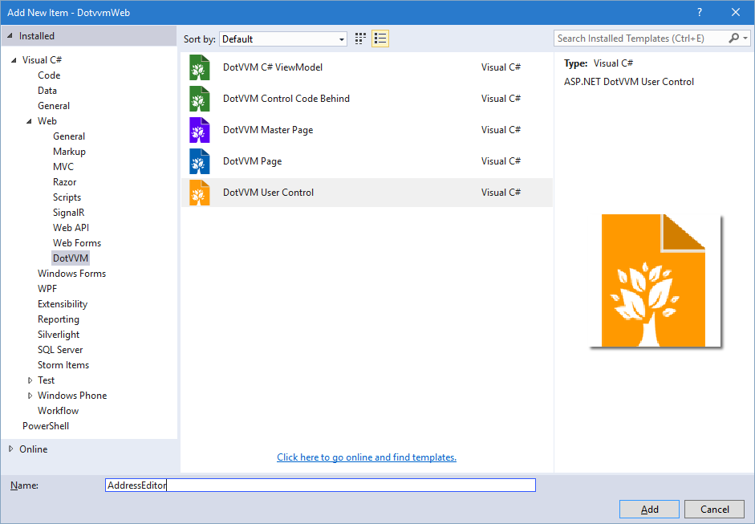
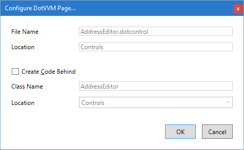
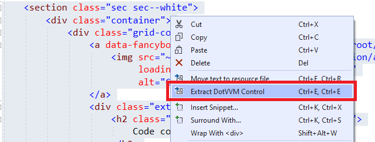

# Markup controls

It is very easy to create a markup control. First, you need to create a file with the `.dotcontrol` extension.

## Create a markup control

Simple markup controls don't need any C# code. In Visual Studio, right click on a project or folder in the *Solution Explorer* window, and select *Add > New Item*.



In the next window, keep the defaults and proceed.



## Extract markup control from page

Sometimes, you want to use the markup controls to keep your page markup shorter and cleaner. 

You can select a part of DotHTML markup, right-click on it, and select the _Extract markup-control_ option.



## Markup control structure

The `.dotcontrol` file can look like this:

```DOTHTML
@viewModel DotvvmDemo.Model.IAddress, DotvvmDemo

<table>
    <tr>
        <td>Street: </td>
        <td><dot:TextBox Text="{value: Street}" /></td>
    </tr>
    ...
    <tr>
        <td>Country: </td>
        <td>
        <dot:ComboBox DataSource="{value: Countries}" 
                      SelectedValue="{value: CountryId}" 
                      ItemTextBinding="{value: Name}" 
                      ItemValueBinding="{value: Id}" />
        </td>
    </tr>
</table>
```

### Binding context type

The markup control files must specify the `@viewModel` directive which tells DotVVM in which [binding context](~/pages/concepts/data-binding/binding-context) the control will be used. It can be an interface or a base class, but the control needs to know on which type the data-bindings are evaluated. 

You can see that the control above requires a binding context of type `IAddress`. It can be used on any place where the `DataContext` implements this interface.

> Remember that neither markup controls nor master pages create an instance of the viewmodel. Only pages have their own viewmodel instance. In master pages and markup controls, the `@viewModel` directive specifies the "contract" for the viewmodel - a base class of the viewmodel, or interface that the viewmodel must implement.  

If your markup control doesn't contain any data-bindings and doesn't depend on a specific viewmodel, use `@viewModel System.Object, mscorlib`. It means that the control can be used in any binding context.

### Control wrapper tag

Markup controls are wrapped inside a `div` tag by default. You can specify the tag you want to use by adding `@wrapperTag` directive. 

If you don't want to use any wrapper tag you can add the `@noWrapperTag` directive.

```DOTHTML
@viewModel DotvvmDemo.Model.IAddress, DotvvmDemo
@wrapperTag table

<tr>
    <td>Street: </td>
    <td><dot:TextBox Text="{value: Street}" /></td>
</tr>
...
<tr>
    <td>Country: </td>
    <td>
        <dot:ComboBox DataSource="{value: _control.Countries}" 
                      SelectedValue="{value: CountryId}" 
                      ItemTextBinding="{value: Name}" 
                      ItemValueBinding="{value: Id}" />
    </td>
</tr>
```

This will render the control inside the `table` tag.

## Register the markup control

In order to use the control, you need to [register it](markup-control-registration) in the `DotvvmStartup.cs` file. You can choose your own prefix and name for the control, e. g. `cc:AddressEditor`.

Then, the control can be used in the page like this:

```DOTHTML
<cc:AddressEditor DataContext="{value: ShippingAddress}" />
<cc:AddressEditor DataContext="{value: BillingAddress}" />
```

See the [Markup control registration](markup-control-registration) chapter for more info.

## Add custom properties to the control

The markup controls can declare custom properties, e. g. for passing additional information aside of the `DataContext`.

The property can be declared:

* By using the `@property` directive __(supported in DotVVM 4.1 and newer)__
* In the [code-behind file](markup-controls-with-code) of the control

### Declare the property using the `@property` directive

The `@property` directive can specify the name and type of the property, its default value, as well as the properties of the __MarkupOptions__ attribute.

```
@property string Title = "Panel"
@property List<CategoryModel> Categories, MarkupOptionsAttribute.AllowHardCodedValue = false
@property Action<CategoryModel> CategoryAdded
@property string[] CategoryTypes = [ "defualt", "premium", "extra" ]
```

* The first declaration creates a `string` property named `Title`. If the user doesn't set this property in the page where the control is used, the default value will be `"Panel"`
* The second declaration creates a property named `Categories` of type `List<CategoryModel>`. It also applies `MarkupOptions.AllowHardCodedValue` to `false`, which means that the property will only accept a binding expression.
* The third declaration creates a property `CategoryAdded` of type `Action<CategoryModel>`. This property can be set with a command or static command binding.
* The fourth declaration creates a property `CategoryTypes` of type `string[]`. If this property is not set, a default value (array with `"defualt"`, `"premium"`, and `"extra"`) will be used.

### Declare the property in the code-behind file

See the [Markup controls with code-behind](markup-controls-with-code) chapter for more info.

### Use the custom property

In the page where the control is used, you can specify the property as an attribute (default behavior), or as an inner element (if you've set the `MappingMode` property to `InnerElement`). Whether the property accepts binding expressions or hard-coded values can be specified using the `AllowBinding` and `AllowHardCodedValues` properties of the `MarkupOptions` attribute.

```DOTHTML
<cc:AddressEditor DataContext="{value: ShippingAddress}" 
                  Countries="{value: Countries}" />
```

In the control markup file, you can access these properties using the `_control` binding property:

```DOTHTML
<dot:ComboBox DataSource="{value: _control.Countries}" />
```

The same rule about when to use [value binding](~/pages/concepts/data-binding/value-binding) or [resource binding](~/pages/concepts/data-binding/resource-binding) is applied here:

* If the property can contain a binding expression and you want to pass that expression to a control inside the markup control, use `value` binding.
* If the property contains a hard-coded value, or the target property doesn't support binding expressions (e. g. `RouteName` of the [RouteLink](~/controls/builtin/RouteLink), use the `resource` binding.

## See also

* [Markup control registration](markup-control-registration)
* [Markup controls with code](markup-controls-with-code)
* [Code-only controls](code-only-controls)
* [Adding interactivity using Knockout binding handlers](interactivity)