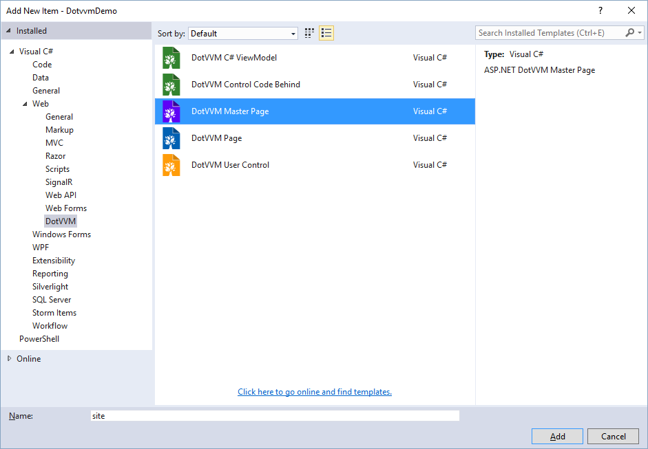
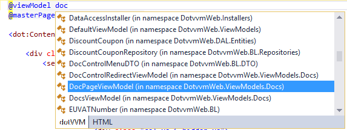
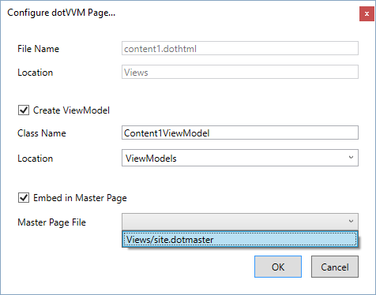

# Master pages

In most web apps, you need all pages to share the same header, menu and footer. **DotVVM** supports a mechanism called **Master pages**. 
If you are familiar with _ASP.NET Web Forms_, the concept of master pages is the same.

Basically, there are two kinds of pages:

1. The **Master page** is a file with `.dotmaster` extension. It defines the layout of the page - in most cases it includes the `<html>`, `<head>` and `<body>` elements. The master page can contain one or more [ContentPlaceHolder](~/controls/builtin/ContentPlaceHolder) controls. These controls mark the places where the content of the page will be placed.     

2. The **Content pages** is a file with the `.dothtml` extension. This page contain one or more [Content](~/controls/builtin/Content) controls. The contents of these controls will be placed in the corresponding `ContentPlaceHolder` controls in the master page.

# [Site.dotmaster](#tab/masterpage)

```DOTHTML
@viewModel DotvvmSample.ViewModels.SiteViewModel, DotvvmSample

<html>
<head>...</head>
<body>
    <header>
        <!-- Common header, menu, logo etc. -->
    </header>
    <section>
        <!-- The content will be placed inside -->
        <dot:ContentPlaceHolder ID="MainContent" />
    </section>
    <footer>
        ...
    </footer>
</body>
</html>
```

# [Default.dothtml](#tab/contentpage)

```DOTHTML
@viewModel DotvvmSample.ViewModels.DefaultViewModel, DotvvmSample
@masterPage Views/Site.dotmaster

<dot:Content ContentPlaceHolderID="MainContent">
    <!-- This content will be placed inside the dot:ContentPlaceHolder control -->
</dot:Content>
```

***

The content page uses the `@masterPage` directive at the top. This directive specifies which master page will be used. 

The path in the `@masterPage` must be a relative path to the `.dotmaster` file from the root directory of the website.

## Routing

The master pages should NOT be registered in the [route table](~/pages/concepts/routing/overview) in the `DotvvmStartup.cs` file. Master pages work only as templates for the content pages. 

The route always points to the `.dothtml` file. If the `@masterPage` directive is found in the page, the contents are embedded in the placeholders from the specified master page.

## Viewmodel of the master page

Even the master page must specify the `@viewmodel` directive. This is required because all binding expression are pre-compiled, and DotVVM needs to know the viewmodel type.

In case of master pages, the type specified in the `@viewModel` directive doesn't have to be a class - it can be also an interface. It is quite common for it to be an abstract class.

The viewmodel of the content page must be assignable to the viewmodel type of the master page.

+ If the viewmodel of the master page is an interface, the content page viewmodel must implement this interface.

+ If the viewmodel of the master page is a class, the content page viewmodel must inherit from this viewmodel (or be the same as the master page viewmodel).

## Nested master pages

You can nest a master page into another master page. Just use the `@masterPage` directive in the master page to specify parent master page. 

In such case, the viewmodel of the child master page must be compatible with the viewmodel of the parent master page (i. e. implement it or inherit from it).

## Default content in placeholders

In most cases, the `<dot:ContentPlaceHolder>` control is left empty - it will host the content from the content page. 

However, if the content page has no corresponding `Content` for the particular placeholder, the content specified inside the `ContentPlaceHolder` will be used as a default content.

```DOTHTML
    <dot:ContentPlaceHolder ID="OptionalContent">
        <!-- This content will be visible if there is no dot:Content element with ContentPlaceHolderID="OptionalContent" in the content page. -->
    </dot:ContentPlaceHolder>
```

## Create the master page

In order to create the master page, all you have to do is to choose **DotVVM Master Page** template in the **New Item** dialog.



After you confirm the selection, another window will appear. In this window, you can specify the name and location of the class that will be 
the viewmodel of the master page. 

If you already have a base viewmodel or an interface for the master page viewmodel, just uncheck the _Create ViewModel_ option.

Make sure that the master page uses the correct viewmodel. If not, delete the `@viewModel` directive value and use the IntelliSense to pick the correct class or interface.



Finally, write your HTML code. On all places where you need to embed something from the content page, use the `<dot:ContentPlaceHolder>` control.

```DOTHTML
<dot:ContentPlaceHolder ID="SomeUniqueId">
</dot:ContentPlaceHolder>
```

Most master pages need only one or two placeholders. However, you can use as many `ContentPlaceHolder`s as you need.

> The commercial version of [DotVVM for Visual Studio](https://www.dotvvm.com/products/visual-studio-extensions) can show the IntelliSense for the `ContentPlaceHolderID` 
property, and much more. 

## Create the content page

Creating the content page is very similar. Just add a new **DotVVM Page** and in the dialog window, and don't forget to click on the **Embed in Master Page** checkbox.

Then, select the correct master page from the list.



The wizard will generate the `<dot:Content>` controls based on the `<dot:ContentPlaceHolder>` controls present in the master page.

> Don't forget that the viewmodel in the content page must be assignable to the viewmodel type specified in the master page.

## See also

* [Viewmodels](~/pages/concepts/viewmodels/overview)
* [Routing](~/pages/routing/overview)
* [ContentPlaceHolder](~/controls/builtin/ContentPlaceHolder)
* [Content](~/controls/builtin/Content)
* [SPA (Single-page applications)](~/pages/concepts/layout/single-page-applications-spa)
