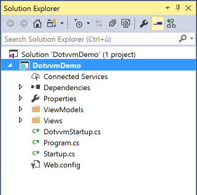
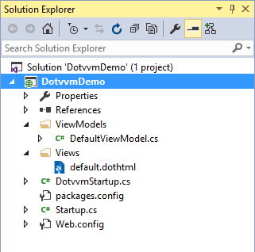

# Project structure    

After you [create a new DotVVM project](~/pages/quick-starts/build/create-new-project), you will see several files in your project:

* `Views/Default.dothtml` - an example page.

* `ViewModels/DefaultViewModel.cs` - an example viewmodel.

* `Startup.cs` - startup class which configures services and registers DotVVM and static files middlewares.

* `DotvvmStartup.cs` - a DotVVM configuration class (see the [Configuration](~/pages/concepts/configuration/overview) chapter).

* `Program.cs` (.NET Core only) - the entry-point of your app (.NET Core projects only).

* `web.config` (.NET Framework only) - a configuration file for ASP.NET and IIS. In ASP.NET Core projects, this file is optional, and is used only when you run the application inside IIS.

.NET Core Project                                                   | .NET Framework Project 
--------------------------------------------------------------------|--------------------------------------------------------------------------
 | 

## Default convention for views and viewmodels

Many people prefer to separate views and viewmodels in the `Views` and `ViewModels` folders. Also, there is a naming convention, that the file `Default.dothtml` corresponds to the `DefaultViewModel` class.

If you install the [DotVVM for Visual Studio](https://www.dotvvm.com/get-dotvvm), it will respect that convention, so if you choose to add a new view in the `Views` folder, it will place the viewmodel in the `ViewModels` folder by default.

> In Visual Studio, you can use the **F7** key to navigate from your view to your viewmodel, and **Shift-F7** to get back to your view.

### Alternatives

Some people prefer to create the `Pages` folder instead, and place the views along the viewmodels. You can even create a separate folder for every page, and also put related CSS or JavaScript files in this folder. 

You can use any convention that suits your needs, e.g. place views together with viewmodels in the same folder.

## See also

* [Create new DotVVM project](~/pages/quick-starts/build/create-new-project)
* [Configuration](~/pages/concepts/configuration/overview)
